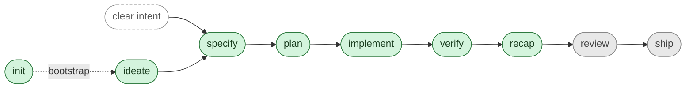

# SpecStudio Skills

The Claude Code skills that make up SpecStudio. Each skill owns one phase of the spec-driven development lifecycle and gates the next on a lint-clean SpecScore artifact.

For the product overview and install instructions, see the [repo README](../README.md). For the design philosophy these skills share, see [`shared/philosophy.md`](./shared/philosophy.md).

## Lifecycle

Each in-line phase consumes the previous phase's lint-clean artifact and gates the next. Green = Shipped, yellow = Defined, gray = Roadmap. `specify` also accepts a clear buildable intent directly — `ideate` is skippable when the problem and scope are already obvious. `init` sits outside the loop: it's the one-time-per-project bootstrap that creates `specscore.yaml` + the `spec/` tree + the canonical instruction snippet, then hands off to `ideate` / `specify` for normal use. Producer handoffs use the shared [publication policy protocol](./shared/publication-policy.md) for staging, commits, pushes, manifest safety, and first-run preference prompts.

## Status

| Skill | Status | Purpose |
|---|---|---|
| [`init`](./init/SKILL.md) | Shipped | Bootstrap a SpecScore-managed project: `specscore.yaml`, `spec/` tree, instruction snippet, orchestration setup. One-time-per-project. |
| [`survey`](./survey/SKILL.md) | Shipped | Produce a fast architecture survey from file topology and structural manifests without reading source files. |
| [`ideate`](./ideate/SKILL.md) | Shipped | Refine raw ideas into lint-clean SpecScore Idea artifacts. |
| [`specify`](./specify/SKILL.md) | Shipped | Turn an approved Idea into a lint-clean SpecScore Feature with G/W/T acceptance criteria. |
| [`plan`](./plan/SKILL.md) | Shipped | Turn an approved Feature into an ordered, AC-mapped Plan artifact at `spec/plans/<slug>.md`. |
| [`implement`](./implement/SKILL.md) | Shipped | Dispatch one subagent per Plan task in parallel batches; stage AC-traceable code changes with a `Verifies:` commit-message trailer; per-batch user-approval gate. |
| [`verify`](./verify/SKILL.md) | Shipped | Produce a per-AC verdict report from `Verifies:` commit trailers; stage at `spec/features/<slug>/_verify/`. |
| [`recap`](./recap/SKILL.md) | Shipped | Produce a per-AC drift report classifying spec↔code divergence; stage at `spec/features/<slug>/_recap/`. |
| `review` | Roadmap | Multi-axis review of code against the Feature it claims to satisfy. |
| `ship` | Roadmap | Pre-launch checklist gated on verify + review passing. |

### Recovery & tooling

Skills outside the lifecycle spine — invoked on demand to recover from misroutes or operate on existing SpecScore artifacts.

| Skill | Status | Purpose |
|---|---|---|
| [`sidekick`](./sidekick/SKILL.md) | Shipped | Capture a sideline idea as a lint-clean seed at `spec/ideas/seeds/<slug>.md` without derailing the host task. |
| [`consilium`](./consilium/SKILL.md) | Shipped | Drain queued sidekick seeds through a 5-stage expert-panel pipeline; produce per-seed verdicts. |
| [`relocate-idea`](./relocate-idea/SKILL.md) | Shipped | Relocate an Idea or sidekick-seed from the current repo to another SpecScore-managed repo. Thin shell over the `specscore idea relocate` CLI verb; appends a best-effort mismatch-log line on success. |

### Status definitions

- **Shipped** — Skill folder exists at `skills/<name>/` with a working `SKILL.md`. Usable today via Claude Code.
- **Defined** — No skill yet. A lint-clean `spec/ideas/<slug>.md` (or Feature) exists with an Approved status; the problem and recommended direction are written down. Next step: promote via `specify`, then implement.
- **Roadmap** — No skill, no Idea, no Feature. The name is reserved on the lifecycle list; scope is TBD. Next step: `ideate` it.

The status cell links to the most-precise artifact that exists for each skill (`SKILL.md` for shipped, the Idea file for defined, no link for roadmap).

## Skills

### `init` — Shipped

Bootstraps a SpecScore-managed project in one wizard-driven step. Detects current state by direct repo inspection, then idempotently creates `specscore.yaml`, scaffolds the `spec/` tree, pastes the canonical Producer-shape instruction snippet into the right platform agent-instructions file, and runs orchestration setup.

- **Output:** `specscore.yaml` + lint-clean `spec/{,ideas,features}/README.md` + the canonical snippet pasted into one of `CLAUDE.md` / `AGENTS.md` / `GEMINI.md` / `.cursor/rules/specstudio.md` per the explicit platform-detection rule.
- **Triggers:** `specstudio:init`, `/specstudio:init`, "set up specstudio", "bootstrap a spec repo".
- **Two modes:** default (full wizard) and `--update` (drift-only reconciliation).
- **CLI delegation:** prefers `specscore init`; AI-agent fallback when the CLI is absent. CLI installation is delegated to `specscore:install` with explicit user consent.
- **Source:** [`init/SKILL.md`](./init/SKILL.md)

### `survey` — Shipped

Produces a fast architecture survey for an existing codebase without reading source implementation files. It scans file topology, reads only allowlisted structural manifests, writes JSON-first artifacts under `spec/research/`, and stages the result.

- **Output:** `spec/research/<slug>-survey.json`, optional `spec/research/<slug>-survey.md`, and `spec/research/README.md` when using the default output directory.
- **Triggers:** `specstudio:survey`, `/survey`, `/specstudio:survey`, "survey this repo", "architecture survey", "map this repo".
- **Gate:** No source implementation file content reads, no Feature/Plan/code writes, no automatic transition to retrofit.
- **Source:** [`survey/SKILL.md`](./survey/SKILL.md)

### `ideate` — Shipped

Refines raw, vague ideas into SpecScore Idea artifacts through structured divergent and convergent thinking.

- **Output:** lint-clean `spec/ideas/<slug>.md` with Problem Statement, Recommended Direction, Alternatives Considered, MVP Scope, Not Doing, Key Assumptions, Open Questions.
- **Triggers:** `ideate`, `/ideate`, "refine this idea", "stress-test this".
- **Gate:** Does not invoke `specify`, `writing-plans`, or any implementation skill until the Idea is lint-clean and user-approved.
- **Source:** [`ideate/SKILL.md`](./ideate/SKILL.md)

### `specify` — Shipped

Turns an approved Idea (or a clear buildable intent) into a SpecScore Feature with requirements and `Given / When / Then` acceptance criteria.

- **Output:** lint-clean `spec/features/<slug>/` containing the Feature, requirements, ACs, and optional Rehearse test stubs.
- **Triggers:** `specify`, `/specify`, "spec this out", or the `idea.approved` event.
- **Gate:** No code, plans, or scaffolding until the Feature is lint-clean and user-approved.
- **Source:** [`specify/SKILL.md`](./specify/SKILL.md)

### `plan` — Shipped

Turns an approved Feature into a single-file Plan at `spec/plans/<slug>.md` — an ordered, AC-mapped task list. Closes the gap where users previously fell back to SpecScore-blind planning skills.

- **Output:** lint-clean `spec/plans/<slug>.md` with tasks numbered 1..N, each bound to ≥1 AC ID from the source Feature.
- **Triggers:** `plan`, `/plan`, `specstudio:plan`, "plan this feature", or the `feature.approved` event.
- **Gate:** AC coverage (every AC covered or explicitly deferred, lint rule `P-001`), lint, baseline reviewer + any third-party reviewers (AND composition), user approval. No transition to `specstudio:implement` until all five hold.
- **Source:** [`plan/SKILL.md`](./plan/SKILL.md)

### `implement` — Shipped

Consumes an approved Plan; dispatches one subagent per task in parallel batches computed from the Plan's `**Depends-On:**` dependency graph; publishes every approved batch through publication policy with a mandatory `Verifies: <feature-slug>#ac:<ac-slug>, ...` commit-message trailer when a commit is created. Linear in user interaction (one approval per batch), parallel in execution (subagent fan-out within a batch).

- **Output:** source-code changes, publication checkpoint disclosures, plus per-task `**Status:**` writes on the Plan file; in `**Mode:** stub` Plans, also writes back task bodies with post-hoc 1–2 sentence summaries.
- **Triggers:** `implement`, `/implement`, `specstudio:implement`, "implement this plan", or the `plan.approved` event.
- **Gate:** Plan Status ∈ {Approved, Implementing}, Source Feature Status ∈ {Approved, Implementing, Stable}, lint after every batch, line-overlap conflict detection post-batch, explicit per-batch user approval, publication policy applied, commit exists before the next batch. Promotion boundary is `specstudio:verify` only.
- **Source:** [`implement/SKILL.md`](./implement/SKILL.md)

### `verify` — Shipped

Consumes an approved Feature and its `Verifies:` commit-message trailers; dispatches one built-in AI subagent per AC (serial) to produce a machine-checkable verdict report at `spec/features/<feature-slug>/_verify/<sha>.md`. Aggregates verdicts into a Markdown report opened by a grep-friendly YAML summary block, applies publication policy, emits `verify.completed`, and transitions only to `specstudio:recap`.

- **Output:** per-AC verdict report at `spec/features/<feature-slug>/_verify/<sha>.md` + `_verify/README.md` index, published according to policy.
- **Triggers:** `verify`, `/verify`, `specstudio:verify`, "verify this feature", or the explicit downstream transition from `specstudio:implement`.
- **Gate:** Feature Status ∈ {Approved, Implementing, Stable}, Feature exists at git HEAD, `specscore` CLI parses the Feature cleanly. Promotion boundary is `specstudio:recap` only.
- **Source:** [`verify/SKILL.md`](./verify/SKILL.md)

### `recap` — Shipped

Consumes an approved Feature plus the latest `specstudio:verify` report at HEAD; dispatches one built-in AI subagent per AC (serial) that classifies divergence between spec and code into the 4-bucket verdict set {no-drift, spec-tighter-than-code, code-tighter-than-spec, contradiction}. Aggregates verdicts into a drift report at `spec/features/<feature-slug>/_recap/<sha>.md`, applies publication policy, emits `recap.completed`, and transitions only to `specstudio:review`.

- **Output:** per-AC drift report at `spec/features/<feature-slug>/_recap/<sha>.md` + `_recap/README.md` index, published according to policy.
- **Triggers:** `recap`, `/recap`, `specstudio:recap`, or the explicit downstream transition from `specstudio:verify`.
- **Gate:** Feature Status ∈ {Approved, Implementing, Stable}, Feature exists at git HEAD, `_verify/` contains at least one report reachable at HEAD. Promotion boundary is `specstudio:review` only.
- **Source:** [`recap/SKILL.md`](./recap/SKILL.md)

### `review` — Roadmap

The skill that does multi-axis code review of an implementation against the Feature it claims to satisfy.

Scope TBD. Next step: `ideate` it.

### `ship` — Roadmap

The skill that runs the pre-launch checklist, gated on `verify` and `review` having passed.

Scope TBD. Next step: `ideate` it.

## Recovery & tooling

### `sidekick` — Shipped

Single-mode capture-and-exit skill. Writes one lint-clean seed at `spec/ideas/seeds/<slug>.md` with required frontmatter and an H1 heading, emits `sidekick-idea.captured`, and returns. Invoked by host skills (`specstudio:ideate`, `specstudio:specify`, third-party adopters) or directly by the user to park a sideline idea without breaking flow. No content-deliberation — that is the consilium's job.

- **Output:** lint-clean `spec/ideas/seeds/<slug>.md` + `sidekick-idea.captured` event.
- **Triggers:** `specstudio:sidekick`, `/sidekick`, "capture a sidekick idea", "side-kick this", "park this idea".
- **Gate:** Validates the one-liner is non-empty; performs destination-resolution in multi-repo workspaces (confirms *where*, never *whether*). No follow-up clarifying questions about the idea's substance.
- **Source:** [`sidekick/SKILL.md`](./sidekick/SKILL.md)

### `consilium` — Shipped

Drains queued sidekick seeds through a 5-stage pipeline: CLI gather → researcher agent → 9-role parallel expert panel → CLI arbiter → scribe agent. Produces a deterministic verdict per seed. The orchestrator task is the structured source of truth; the seed gets only the scribe's prose summary mirrored into a `## Consilium Verdict` section. Per-project roster and gate configurable via `specscore.yaml → consilium:` block.

- **Output:** per-seed verdict + scribe summary mirrored onto the seed file; `sidekick-idea.reviewed` event per successful task.
- **Triggers:** `specstudio:consilium`, `/consilium`, "run the consilium", "drain the sidekick queue", "review sidekick ideas".
- **Gate:** Cross-repo dependencies (orchestrator tasks, CLI arbiter) must be present. On any stage failure, the task transitions to `failed` and the next queued task continues.
- **Source:** [`consilium/SKILL.md`](./consilium/SKILL.md)

### `relocate-idea` — Shipped

A thin shell over the [`specscore idea relocate`](https://github.com/specscore/specscore-cli/blob/main/spec/features/cli/idea/relocate/README.md) CLI verb. Relocates an Idea (`spec/ideas/<slug>.md`) or sidekick seed (`spec/ideas/seeds/<slug>.md`) from the current repo to another SpecScore-managed repo. The CLI handles every mechanic — pre-flight clean-tree checks, file copy + in-file rewrite, cross-repo link cleanup, per-repo commits, rollback on failure. The skill's job is argument collection, shell-out, verbatim output surfacing, and a single best-effort mismatch-log line on success.

- **Output:** the CLI verb's per-repo lines plus summary (verbatim), and one JSON line appended to `.specscore/destination-resolution-log.jsonl` in the source repo's cwd on exit 0.
- **Triggers:** `specstudio:relocate-idea`, `/relocate-idea`, "relocate this idea", "move this seed to another repo".
- **Gate:** `specscore` must be on PATH (delegate install to `/specscore:install` if missing). The skill surfaces the CLI's exit code verbatim — no paraphrasing of rollback commands on commit failure.
- **Companion Feature:** [`sidekick-capture/destination-resolution`](../spec/features/sidekick-capture/destination-resolution/README.md) — defines this skill alongside the sidekick pre-write destination-resolution hook.
- **Source:** [`relocate-idea/SKILL.md`](./relocate-idea/SKILL.md)

## `shared/`

Not a skill. [`shared/`](./shared/) holds cross-cutting reference material the SKILL.md files load on demand: the philosophy, path conventions, lint rules, the event vocabulary, the Rehearse heuristic, and the question cadence. Treat these as the kit every skill imports from, not as something a user invokes.
